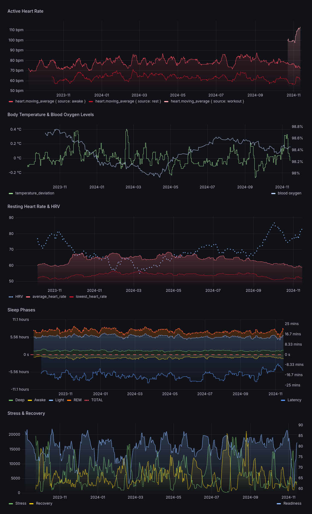

# OURA -> INFLUXDB sync

```sh
docker run \
 -e OURASYNC_OURA_TOKEN=$(pass oura/token) \
 -e OURASYNC_INFLUXDB_TOKEN=$(pass influxdb/token) \
 -e OURASYNC_INFLUXDB_URL="http://influxdbhost:8086" \
 -e OURASYNC_INFLUXDB_ORG="org" \
 -e OURASYNC_INFLUXDB_BUCKET="bucket" \
 -it ourasync
```

# Grafana


my quick dashboard .json as example available in misc/ dir
